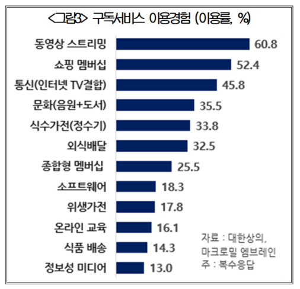
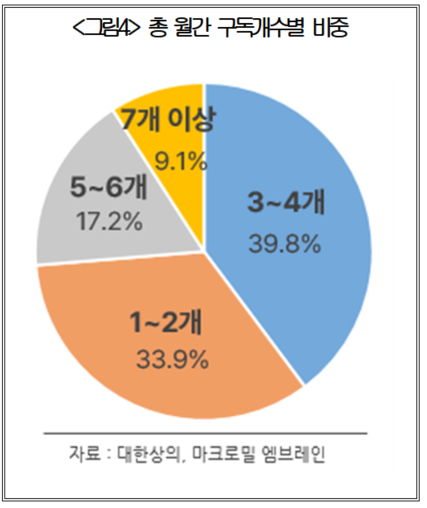

  

# Subscription Waste Detection System

   

### Student Information

**Student No:** 22421747
**Name:** 박경진
**E-mail:** 241010bgj@yu.ac.kr

---

## [Revision History]

| Date | Version | Description | Author |
|:----|:-------:|------------:|:------|
| 2026-03-27 | 0.01 | Initial Draft | 박경진 |

---

# =Contents=

  
1. [Business Purpose](#1-business-purpose)  
2. [System Context Diagram](#2-system-context-diagram)  
3. [Use Case List](#3-use-case-list)  
4. [Concept of Operation](#4-concept-of-operation)  
5. [Problem Statement](#5-problem-statement)  
6. [Glossary](#6-glossary)  
7. [References](#7-references)

---

# 1. Business purpose
## 1.1 Project background

   
  [그림1]
   
  [그림2]

## Goal

본 시스템의 목표는 다음과 같다.
- 구독 서비스 사용 패턴 분석
- 사용률 기반 낭비 여부 판단
- 사용자에게 해지 또는 유지 추천 분석 제공

결과적으로, 사용자가 불필요한 소비를 줄여 효율적인 구독 관리를 할 수 있게 지원한다. 

---

# 2. System context diagram

---

# 3. Use Case List

## 1) 구독 서비스 등록

| 항목 | 내용 |
|------|------|
| Actor | User |
| Description | 사용자는 새로운 구독 서비스를 시스템에 등록한다. 서비스 이름, 가격, 결제일 등의 정보를 입력한다. |

## 2) 구독 서비스 수정

| 항목 | 내용 |
|------|------|
| Actor | User |
| Description | 사용자는 기존에 등록된 구독 서비스의 정보를 수정할 수 있다. |

---

## 3) 구독 서비스 삭제

| 항목 | 내용 |
|------|------|
| Actor | User |
| Description | 사용자는 더 이상 사용하지 않는 구독 서비스를 삭제할 수 있다. |

---

## 4) 사용 여부 기록

| 항목 | 내용 |
|------|------|
| Actor | User |
| Description | 사용자는 특정 구독 서비스를 실제로 사용했는지 여부를 기록한다. |

---

## 5) 사용률 계산

| 항목 | 내용 |
|------|------|
| Actor | System |
| Description | 시스템은 일정 기간 동안의 사용 데이터를 기반으로 사용률을 계산한다. |

---

## 6) 낭비 여부 분석

| 항목 | 내용 |
|------|------|
| Actor | System |
| Description | 시스템은 사용률이 낮은 구독 서비스를 분석하여 낭비 여부를 판단한다. |

---

## 7) 낭비 경고 알림

| 항목 | 내용 |
|------|------|
| Actor | System |
| Description | 사용률이 낮은 서비스에 대해 사용자에게 알림을 제공한다. |

---

## 8) 해지 추천

| 항목 | 내용 |
|------|------|
| Actor | System |
| Description | 시스템은 사용 패턴을 기반으로 해지를 추천한다. |

---

## 9) 소비 통계 제공

| 항목 | 내용 |
|------|------|
| Actor | System |
| Description | 월별 구독 비용과 사용 패턴을 분석하여 통계를 제공한다. |

---

## 10) 리포트 생성

| 항목 | 내용 |
|------|------|
| Actor | System |
| Description | 전체 구독 사용 패턴과 낭비 분석 결과를 요약한 리포트를 생성한다. |
