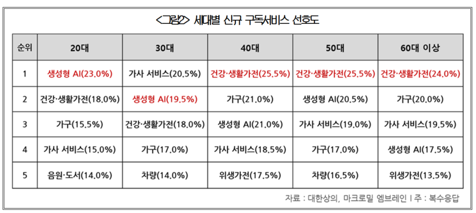
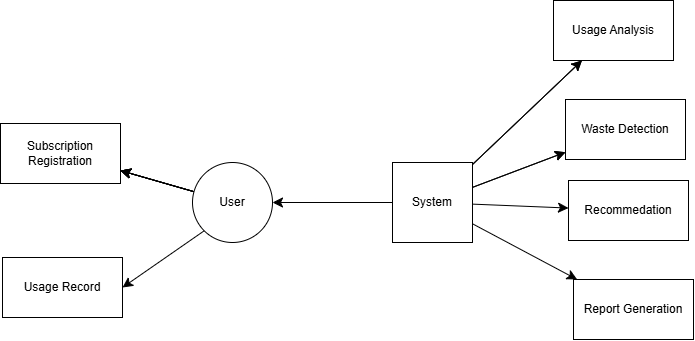

  

# Subscription Waste Detection System

    

### Student Information

| **Student No** | 22421747 |
|---------------|----------|
| **Name** | 박경진 |
| **E-mail** | 241010bgj@yu.ac.kr |

---

## [Revision History]

| Date | Version | Description | Author |
|:----|:-------:|------------:|:------|
| 2026-03-27 | 0.01 | Initial Draft | 박경진 |

    

---

# =Contents=

  
1. [Business Purpose](#1-business-purpose)  
2. [System Context Diagram](#2-system-context-diagram)  
3. [Use Case List](#3-use-case-list)  
4. [Concept of Operation](#4-concept-of-operation)  
5. [Problem Statement](#5-problem-statement)  
6. [Glossary](#6-glossary)  
7. [References](#7-references)

    

---

# 1. Business purpose
### 1.1 Project background

  <figure style="flex:1; text-align:center;">
    
    <figcaption>[그림 1]</figcaption>
  </figure>

  <figure style="flex:1; text-align:center;">
    
    <figcaption>[그림 2]</figcaption>
  </figure>

이 시대의 구독 서비스는 현대인의 일상 전반에 깊이 자리 잡고 있다. 과거에는 영화 감상이나 음악 감상과 같은 개인의 여가 활동을 중심으로 구독 서비스가 이용되었지만, 최근에는 소프트웨어, 클라우드 서비스, 교육 플랫폼, 생활 편의 서비스 등 다양한 분야로 확장되고 있다. [그림 1]과 같이 구독 서비스의 적용 범위가 지속적으로 확대됨에 따라, 앞으로 더 많은 서비스가 구독 기반 비즈니스 모델을 채택할 것으로 예상된다. 이 같은 변화는 사용자에게 편리함과 지속적인 서비스 이용 환경을 제공하지만, 동시에 여러 개의 구독 서비스를 동시에 관리해야 하는 부담을 증가시키고 있다.

특히 대부분의 구독 서비스가 자동 결제 방식으로 운영되기 때문에, 사용하지 않는 서비스임에도 불구하고 비용이 계속 지출되는 문제가 발생할 수 있다. 실제로 많은 사용자들이 자신이 구독 중인 서비스의 수나 사용 빈도를 정확하게 파악하지 못하는 경우가 있으며, 이로 인해 불필요한 소비가 발생하기도 한다.

이 문제를 해결하기 위해 구독 서비스의 사용 패턴을 체계적으로 관리하고 분석할 수 있는 시스템이 필요하다. 따라서 본 프로젝트에서는 사용자의 구독 서비스 이용 데이터를 기반으로 사용률을 분석하고, 낭비 가능성이 있는 구독 서비스를 식별하여 사용자에게 정보를 제공하는 Subscription Waste Detection System을 제안한다.

### 1.2 Goal

- 구독 서비스 사용 패턴 분석
- 사용률 기반 구독료 낭비 여부 판단
- 사용자에게 해지 또는 유지 추천 분석 제공

결과적으로, 사용자가 구독 관리를 쉽게 할 수 있게 지원하고자 한다.

---

# 2. System context diagram

  <figure style="flex:1; text-align:center;">
    
    <figcaption>[다이어그램]</figcaption>
  </figure>

- User 사용자  
  시스템을 사용하는 주체로, 구독 서비스를 등록하고 사용 여부를 기록하며 분석 결과를 확인한다.

- System 시스템  
  구독 서비스 데이터를 관리하고 사용 패턴을 분석하여 낭비 여부를 판단하는 전체 프로그램 환경을 의미한다.

- Core 핵심 기능  
  구독 서비스 사용 데이터 수집, 사용률 분석, 낭비 구독 탐지, 추천 생성 등의 주요 기능을 수행하는 모듈이다.

- Data 데이터 저장소  
  사용자가 등록한 구독 서비스 정보, 사용 기록, 분석 결과 등을 저장하는 데이터베이스 영역이다.

- Subscription Data 구독 서비스 정보  
  서비스 이름, 가격, 결제일 등 사용자가 입력한 구독 서비스의 기본 정보이다.

- Usage Data 사용 기록 데이터  
  사용자가 특정 구독 서비스를 실제로 사용했는지 기록한 데이터로, 사용 패턴 분석에 활용된다.

- Analysis Result 분석 결과  
  시스템이 계산한 사용률, 낭비 가능성 판단 결과, 추천 정보 등을 포함한다.

사용자는 구독 서비스 정보를 시스템에 등록하고 사용 여부를 기록한다. 시스템은 저장된 데이터를 기반으로 사용 패턴을 분석하여 사용률을 계산하고, 사용이 적은 구독 서비스를 식별하여 사용자에게 관리 및 해지 여부에 대한 정보를 제공한다.

 

---

# 3. Use Case List

### 1) 구독 서비스 등록
<table style="width:100%; table-layout:fixed;">
  <tr>
    <th style="width:15%; text-align:left;">항목</th>
    <th style="width:85%; text-align:justify;">내용</th>
  </tr>
  <tr><td>Actor</td><td>User</td></tr>
  <tr><td>Description</td><td>사용자는 새로운 구독 서비스를 시스템에 등록한다. 서비스 이름, 가격, 결제일 등의 정보를 입력한다.</td></tr>
</table>

### 2) 구독 서비스 수정
<table style="width:100%; table-layout:fixed;">
  <tr>
    <th style="width:15%; text-align:left;">항목</th>
    <th style="width:85%; text-align:justify;">내용</th>
  </tr>
  <tr><td>Actor</td><td>User</td></tr>
  <tr><td>Description</td><td>사용자는 기존에 등록된 구독 서비스의 정보를 수정할 수 있다.</td></tr>
</table>

### 3) 구독 서비스 삭제
<table style="width:100%; table-layout:fixed;">
  <tr>
    <th style="width:15%; text-align:left;">항목</th>
    <th style="width:85%; text-align:justify;">내용</th>
  </tr>
  <tr><td>Actor</td><td>User</td></tr>
  <tr><td>Description</td><td>사용자는 더 이상 사용하지 않는 구독 서비스를 삭제할 수 있다.</td></tr>
</table>

### 4) 사용 여부 기록
<table style="width:100%; table-layout:fixed;">
  <tr>
    <th style="width:15%; text-align:left;">항목</th>
    <th style="width:85%; text-align:justify;">내용</th>
  </tr>
  <tr><td>Actor</td><td>User</td></tr>
  <tr><td>Description</td><td>사용자는 특정 구독 서비스를 실제로 사용했는지 여부를 기록한다.</td></tr>
</table>

### 5) 사용률 계산
<table style="width:100%; table-layout:fixed;">
  <tr>
    <th style="width:15%; text-align:left;">항목</th>
    <th style="width:85%; text-align:justify;">내용</th>
  </tr>
  <tr><td>Actor</td><td>System</td></tr>
  <tr><td>Description</td><td>시스템은 일정 기간 동안의 사용 데이터를 기반으로 사용률을 계산한다.</td></tr>
</table>

### 6) 낭비 여부 분석
<table style="width:100%; table-layout:fixed;">
  <tr>
    <th style="width:15%; text-align:left;">항목</th>
    <th style="width:85%; text-align:justify;">내용</th>
  </tr>
  <tr><td>Actor</td><td>System</td></tr>
  <tr><td>Description</td><td>시스템은 사용률이 낮은 구독 서비스를 분석하여 낭비 여부를 판단한다.</td></tr>
</table>

### 7) 낭비 경고 알림
<table style="width:100%; table-layout:fixed;">
  <tr>
    <th style="width:15%; text-align:left;">항목</th>
    <th style="width:85%; text-align:justify;">내용</th>
  </tr>
  <tr><td>Actor</td><td>System</td></tr>
  <tr><td>Description</td><td>사용률이 낮은 서비스에 대해 사용자에게 알림을 제공한다.</td></tr>
</table>

### 8) 해지 추천
<table style="width:100%; table-layout:fixed;">
  <tr>
    <th style="width:15%; text-align:left;">항목</th>
    <th style="width:85%; text-align:justify;">내용</th>
  </tr>
  <tr><td>Actor</td><td>System</td></tr>
  <tr><td>Description</td><td>사용 패턴을 기반으로 해지를 추천한다.</td></tr>
</table>

### 9) 소비 통계 제공
<table style="width:100%; table-layout:fixed;">
  <tr>
    <th style="width:15%; text-align:left;">항목</th>
    <th style="width:85%; text-align:justify;">내용</th>
  </tr>
  <tr><td>Actor</td><td>System</td></tr>
  <tr><td>Description</td><td>월별 구독 비용과 사용 패턴을 분석하여 통계를 제공한다.</td></tr>
</table>

### 10) 리포트 생성
<table style="width:100%; table-layout:fixed;">
  <tr>
    <th style="width:15%; text-align:left;">항목</th>
    <th style="width:85%; text-align:justify;">내용</th>
  </tr>
  <tr><td>Actor</td><td>System</td></tr>
  <tr><td>Description</td><td>전체 구독 사용 패턴과 낭비 분석 결과를 요약한 리포트를 생성한다.</td></tr>
</table>

---

# 4. Concept of Operation

### 1) Subscription Management
| **Purpose** | 구독 서비스 정보 관리 |
|------------|--------------|
| **Approach** | 사용자가 서비스 이름, 가격, 결제일 등의 정보를 입력하면 시스템이 이를 데이터베이스에 저장하고 수정 및 삭제 기능을 제공 |
| **Dynamics** | 사용자가 구독 정보를 등록하거나 변경할 때마다 데이터가 즉시 업데이트됨 |
| **Goals** | 모든 구독 정보를 체계적으로 관리하고 이후 분석을 위한 기반 데이터 확보 |

### 2) Usage Tracking
| **Purpose** | 사용 패턴 수집 |
|------------|--------------|
| **Approach** | 사용자가 특정 구독 서비스를 사용했는지 여부를 기록하면 시스템이 사용 로그 형태로 데이터베이스에 저장 |
| **Dynamics** | 사용자 입력 시마다 사용 기록이 누적되어 일정 기간의 사용 데이터가 형성됨 |
| **Goals** | 정확한 사용 데이터 확보 및 분석 기반 마련 |

### 3) Usage Analysis
| **Purpose** | 서비스 사용률 분석 |
|------------|--------------|
| **Approach** | 일정 기간 동안의 사용 기록을 기반으로 사용 횟수, 최근 사용 여부 등을 분석하여 사용률 계산 |
| **Dynamics** | 시스템이 주기적으로 데이터를 분석하고 사용률을 갱신 |
| **Goals** | 사용 빈도가 낮은 서비스 식별을 위한 기준 제공 |

### 4) Waste Detection 
| **Purpose** | 낭비되는 구독 식별 |
|------------|--------------|
| **Approach** | 분석된 사용률과 최근 사용 여부를 기준으로 사용이 거의 없는 서비스를 탐지 |
| **Dynamics** | 사용 데이터가 업데이트될 때마다 낭비 여부가 재평가됨 |
| **Goals** | 불필요한 구독 비용 발생 가능성 파악 |

### 5) Recommendation System
| **Purpose** | 사용자 의사결정 지원 |
|------------|--------------|
| **Approach** | 사용률 분석 결과를 기반으로 구독 유지 또는 해지에 대한 추천 제공 |
| **Dynamics** | 낭비 가능성이 높은 서비스가 발견되면 사용자에게 결과 제공 |
| **Goals** | 효율적인 구독 관리 및 비용 절감 지원 |

# 5. Problem Statement
### 5.1 Overview
구독 경제가 확산되면서 많은 사용자들이 가입한 서비스의 구독 관리에 어려움을 겪고 있다. 구독 낭비 방지 시스템은 그 문제들을 해결하기 위해 다음의 목적을 달성하고자 한다.
 
- 자동 결제로 인한 불필요한 지출 방지
- 사용 패턴의 가시화를 통한 소비 패턴 분석
- 데이터 기반 구독 관리 지원

### Problem #1 - 사용 데이터 수집의 정확성 문제
사용자의 입력 데이터에만 의존할 경우 누락된 기록이 발생할 수 있으며, 이는 분석 정확도에 치명적인 영향을 줄 수 있다. 시스템은 구독 서비스 사용 여부를 기록하는 사용 로그(Usage Log) 데이터 구조를 설계하고 데이터베이스에 저장한다. 일정 기간 동안 입력이 없는 경우에는 사용자에게 기록 알림 기능을 제공하여 데이터 누락을 최소화 한다. 이로써 최소한의 데이터 신뢰성을 확보한다.

### Problem #2 - 낭비 판단 기준 설계의 어려움
구독 서비스의 사용 빈도와 필요성이 사용자마다 달라 일정한 기준으로 알고리즘을 설계하기 쉽지 않다. 단순히 사용 횟수뿐 아니라 다음과 같은 요소를 함께 고려 하려 한다.
- 최근 사용 여부
- 일정 기간 동안의 사용 횟수
- 서비스 비용
- 사용 간격
일정 기간(예: 30일) 동안의 데이터를 기반으로 사용률 계산 로직을 적용하고, 특정 기준 이하의 서비스에 대해 낭비 가능성을 판단하는 Rule-based 분석 방식을 적용한다.

### Problem #3 - 사용자 인터페이스 설계 문제
직관적인 사용자 인터페이스를 제공하여 사용자가 구독 서비스를 쉽게 등록하고 관리할 수 있어야 한다. 
다음과 같은 기능을 제공하도록 설계한다.
- 구독 서비스 등록 및 수정 기능
- 사용 여부 기록 기능
- 사용률 시각화 기능 (통계 또는 그래프 형태)
- 낭비 가능 서비스 목록 표시
사용자가 자신의 구독 상태를 한눈에 확인할 수 있도록 한다.

### Problem #4 - 데이터 증가 및 시스템 성능 문제
사용자 수가 증가하거나 관리되는 구독 서비스 수가 많아질 경우 사용 기록 데이터가 빠르게 증가할 수 있다. 이를 해결하기 위해 시스템은 다음과 같은 구조를 갖춰야 한다.
- 구독 정보와 사용 기록을 분리한 데이터베이스 구조 설계
- 효율적인 데이터 저장을 위한 테이블 기반 데이터 관리
- 주기적인 분석 작업을 수행하는 배치 분석 방식
대량의 데이터가 발생하더라도 안정적으로 분석이 가능하도록 한다.

### Problem #5 - 개인 정보 및 보안 문제
사용자의 구독 정보와 사용 데이터는 개인 소비 패턴을 포함하기 때문에 보호가 필요하다. 
- 사용자 계정 기반 접근 제어
- 인증된 사용자만 데이터 접근 가능
- 사용자 데이터와 분석 데이터 분리 저장
- 민감 정보 보호를 위한 데이터 관리 정책 적용
사용자 정보의 안전성을 확보하고 시스템 신뢰성을 유지한다.
---

# 6. Glossary

| Subscription | 일정 기간마다 자동으로 비용이 결제되며 지속적으로 서비스를 이용할 수 있는 정기 결제 기반 서비스. |
|-------------|-----------------------------------------------------------------------------------|
| Subscription Service | 사용자가 등록하여 관리하는 개별 구독 서비스 항목을 의미하며, 서비스 이름, 가격, 결제일 등의 정보를 포함한다. |
| Usage Log | 사용자가 특정 구독 서비스를 실제로 이용했는지 여부를 기록한 데이터. 시스템의 사용률 분석에 활용된다. | 
| Usage Rate | 일정 기간 동안 기록된 사용 데이터를 기반으로 계산되는 서비스 이용 비율. |
| Waste (Subscription Waste) | 사용 빈도가 낮거나 거의 사용되지 않음에도 불구하고 비용이 계속 지출되는 구독 상태를 의미한다. |
| Waste Detection | 시스템이 사용률과 사용 패턴을 분석하여 낭비 가능성이 있는 구독 서비스를 식별하는 과정. |
| Recommendation | 분석 결과를 기반으로 시스템이 사용자에게 제공하는 유지 또는 해지 관련 제안. |
| User | 구독 서비스를 등록하고 사용 기록을 입력하며 분석 결과를 확인하는 시스템의 이용자. |
| System | 구독 서비스 정보 관리, 사용 데이터 분석, 낭비 탐지 및 추천 기능을 수행하는 Subscription Waste Detection System. |
| Report | 일정 기간 동안의 구독 사용 패턴, 소비 통계, 낭비 분석 결과를 요약하여 제공하는 결과 정보. |
---

# 7. References

[1] 그림 1, 2 - [https://www.korcham.net/nCham/Service/Economy/appl/KcciReportDetail.asp?CHAM_CD=B001&SEQ_NO_C010=20120940674](https://www.korcham.net/nCham/Service/Economy/appl/KcciReportDetail.asp?CHAM_CD=B001&SEQ_NO_C010=20120940674)
